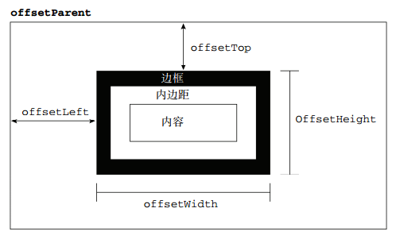

## offset/scroll/client

* offsetWidth/offsetHeight: width/height + padding + border
* scrollWidth/scrollHeight: width/height + padding
* clientWidth/clientHeight: width/height + padding


## offset系列 
* 1.原生javascript中：
    + offsetLeft和offsetTop

    从离自己最近的已经定位了的父亲元素开始算起。

    offsetLeft是以border的左上角开始计算；style.left是以margin的左上角开始计算

    也就是说，offsetLeft/offsetTop是包含外边距在内的
* 2.jQuery中：
    + $(selector).offset()

    > 返回的是一个对象{left:num,top:num};

    ***获取元素相对于文档document的位置***

        + 取值：var left = $(selector).offset().left;
        + 设置：$(selector).offset({left:100,top:100});
        + 注意：使用offset进行操作时，如果元素没有设置定位，则会将元素设置为relative定位。
    + $(selector).position()
    > 只读属性。获取到的也是一个对象{left:num, top:num}。取值同上 

    ***获取元素相对于最近定位了的父元素***

    ```html
    <!DOCTYPE html>
    <html>
        <head lang="en">
        <meta charset="UTF-8">
        <title></title>
        <style>
             * {
                 margin: 0;
                 padding: 0;
               }
           div {
                 width: 200px;
                 height: 200px;
                 background-color: red;
                 margin: 200px;
                 position: absolute;
               }
             p {
                 position: absolute;
                 width: 100px;
                 height: 100px;
                 left: 50px;
                 top: 50px;
                 background-color: yellow;
               }
        </style>
        <script src="jquery-1.12.4.js"></script>
        </head>
        <body>
            <div><p></p></div>
            <script>
             console.log($('p').offset().left); //250
             console.log($('p').offset().top); //250
             console.log($('p').position().left); //50
             console.log($('p').position().top); //50
            </script>
        </body>
</html>
```

## scroll系列
* 1.原生javascript中：
    + scrollTop/scrollLeft

    已经卷起来的高度和宽度（包括边框在内）
    + 获取页面滚动坐标：
    var scrollTop = window.pageYOffset || document.documentElement.scrollTop || document.body.scrollTop || 0;
* 2.jquery中：
    + $(selector).scrollTop(100)    //设置
    + $(selector).scrollLeft()      //获取
    + 在这里有一点要注意：$(selector)指的是有滚动条的元素，而不是对任何元素相对于文档窗口的滚动距离的设置。

## client系列
    + 网页可视区宽高
    var clientWidth = window.innerWidth || document.documentElement.clientWidth || document.body.clientWidth || 0;

